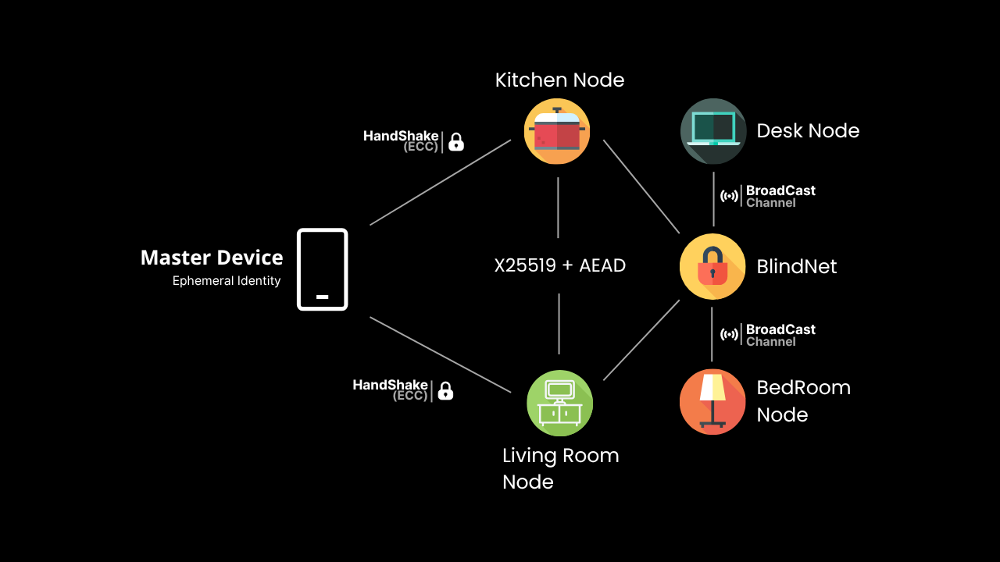

<p align="center">
  
</p>

<h1 align="center">🔒 BlindNet Core</h1>
<p align="center">
  <strong>Rede local, distribuída e sem memória persistente</strong><br>
  Dispositivos cooperativos que aprendem, atuam e protegem — <em>sem rastrear, sem guardar nada, sem nuvem</em>.
</p>

<p align="center">
  <a href="https://github.com/SEU_USUARIO/blindnet-core/actions/workflows/ci.yml">
    
  </a>
  <a href="https://github.com/SEU_USUARIO/blindnet-core/actions/workflows/audit.yml">
    
  </a>
  
  
</p>

---

## 🔍 Sumário

1. [Visão Geral](#1-visão-geral)  
2. [Principais Diferenciais](#2-principais-diferenciais)  
3. [Quick Start (<30s)](#3-quick-start-30s)  
4. [Detalhes da Arquitetura](#4-detalhes-da-arquitetura)  
5. [Estrutura do Projeto](#5-estrutura-do-projeto)  
6. [Build, Testes e Auditoria](#6-build-testes-e-auditoria)  


---

## 1. Visão Geral

**BlindNet** é um **ecossistema de agentes distribuídos**, escrito em Rust, que:

- Gera **identidades efêmeras** (Curve25519) por sessão.  
- Estabelece **canais P2P criptografados** (X25519 + AES-GCM).  
- Atua como “copiloto digital” em cada ambiente, reagindo a eventos do **dispositivo-mestre**.  
- **Não persiste** qualquer dado em disco ou flash — toda memória se apaga ao reiniciar.

O objetivo é oferecer ambientes domésticos ou corporativos que **se adaptam ao usuário** com **privacidade total**, sem depender de nuvem ou registros.
Esse modelo garante **privacidade total** e **resiliência**: mesmo que um nó seja reiniciado ou comprometido, ele não carrega nenhuma bagagem de sessão anterior.

---

## 2. Principais Diferenciais

| Diferencial               | Por que importa                                        |
|---------------------------|--------------------------------------------------------|
| **Stateless**             | Zero logs, zero riscos de vazamento local              |
| **Rust Full-Stack**       | Segurança de memória + desempenho em ambientes críticos|
| **Criptografia Auditada** | Uso de crates confiáveis da RustCrypto                 |
| **Modular e Extensível**  | Futuro suporte a cápsulas WASM e hardware real (ESP32) |
| **Simples de Rodar**      | Rodar em CLI com um comando, sem configuração extra    |

A BlindNet se destaca por combinar várias tecnologias e práticas de ponta:

- **Stateless**  
  - Todos os dados residem apenas em RAM.  
  - Reboot = memória zero.

- **Rust Full-Stack**  
  - Segurança de memória e concorrência com `tokio`.  
  - Sem “unsafe”, visando robustez em produção.

- **Criptografia Auditada**  
  - X25519 para troca de chaves.  
  - AES-GCM (AEAD) para confidencialidade e integridade.  
  - Uso exclusivo de crates confiáveis da RustCrypto.

- **Modular e Extensível**  
  - Futuro suporte a “cápsulas” WASM para lógica dinâmica.  
  - Possível port para ESP32, RP2040 e outras arquiteturas embutidas.

- **Experiência Instantânea**  
  - CLI simples: um único comando para rodar o demo.  
  - GIF e logs coloridos ajudam a validar em segundos.
---

## 3. Quick Start (<30s)

```bash
git clone https://github.com/SEU_USUARIO/blindnet-core.git
cd blindnet-core
cargo run -p runtime -- --nodes 3
```

---

## 4. Detalhes da Arquitetura

```text
                 Handshake ECC
    [ Mestre (smartphone) ] ↔──────────────┐
           broadcast seguro                │
                                           ▼
    ┌──────────┐   P2P Encrypted   ┌──────────┐
    │ Nó Sala  │ ◀────────────── ▶│Nó Cozinha│
    └──────────┘                   └──────────┘
         ▲  ▲                           ▲  ▲
         │  └─── AEAD Messaging ────────┘  │
         │                                 │
    ┌──────────┐                     ┌──────────┐
    │ Nó Quarto│                     │Nó Oficina│
    └──────────┘                     └──────────┘

```
---

## 5. Estrutura do Projeto

```text
blindnet-core/
├── .github/
│   └── workflows/          # CI e auditoria de dependências
├── crates/
│   ├── runtime/            # Demo CLI e simulação de nós
│   │   └── src/{ … }       
│   └── capsule-sdk/        # (futuro) APIs para cápsulas WASM
├── docs/                   # Diagramas, threat model, roadmap, contributing
├── examples/               # Scripts de execução e GIFs de demonstração
├── scripts/                # Hooks locais (pre-commit.sh)
├── Cargo.toml              # Workspace definition
├── rust-toolchain.toml     # Versão mínima do Rust
├── LICENSE                 # MIT License
└── README.md               # Este arquivo
```

---

## 6. Build, Testes e Auditoria
```bash
# Formatação e lint
cargo fmt --all -- --check
cargo clippy --workspace -- -D warnings

# Testes
cargo test --workspace

# Auditoria de dependências
cargo install cargo-audit        # (exec somente uma vez)
cargo audit
```


