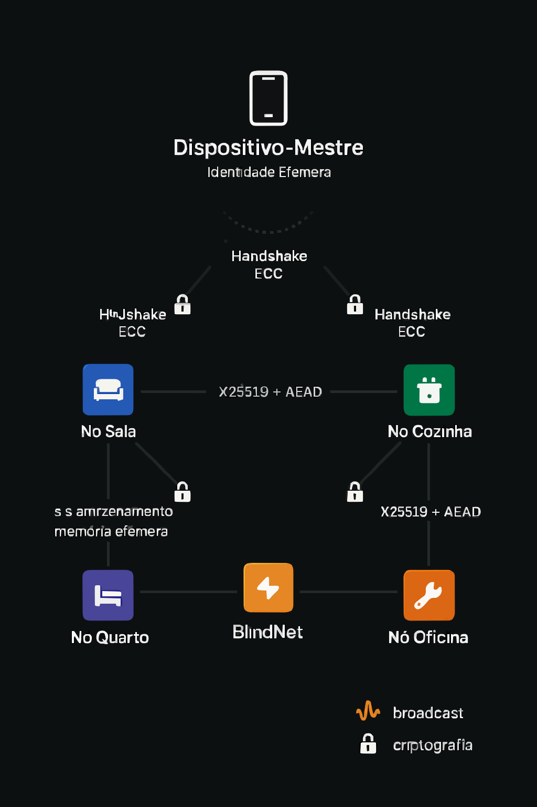

<p align="center">
  
</p>

<h1 align="center">🔒 BlindNet Core</h1>
<p align="center">
  <strong>Rede local, distribuída e sem memória persistente</strong><br>
  Dispositivos cooperativos que aprendem, atuam e protegem — <em>sem rastrear, sem guardar nada, sem nuvem</em>.
</p>

<p align="center">
  <a href="https://github.com/SEU_USUARIO/blindnet-core/actions/workflows/ci.yml">
    
  </a>
  <a href="https://github.com/SEU_USUARIO/blindnet-core/actions/workflows/audit.yml">
    
  </a>
  
  
</p>

---

## 🔍 Sumário

1. [Visão Geral](#1-visão-geral)  
2. [Principais Diferenciais](#2-principais-diferenciais)  
3. [Quick Start (≤ 30 s)](#3-quick-start-≤30s)  
4. [Detalhes da Arquitetura](#4-detalhes-da-arquitetura)  
5. [Estrutura do Projeto](#5-estrutura-do-projeto)  
6. [Build, Testes e Auditoria](#6-build-testes-e-auditoria)  


---

## 1. Visão Geral

**BlindNet** é um **ecossistema de agentes distribuídos**, escrito em Rust, que:

- Gera **identidades efêmeras** (Curve25519) por sessão.  
- Estabelece **canais P2P criptografados** (X25519 + AES-GCM).  
- Atua como “copiloto digital” em cada ambiente, reagindo a eventos do **dispositivo-mestre**.  
- **Não persiste** qualquer dado em disco ou flash — toda memória se apaga ao reiniciar.

**Objetivo:** oferecer ambientes domésticos ou corporativos que **se adaptam ao usuário** com **privacidade total**, sem depender de nuvem ou registros.

---

## 2. Principais Diferenciais

| Diferencial               | Por que importa                                        |
|---------------------------|--------------------------------------------------------|
| **Stateless**             | Zero logs, zero riscos de vazamento local              |
| **Rust Full-Stack**       | Segurança de memória + desempenho em ambientes críticos|
| **Criptografia Auditada** | Uso de crates confiáveis da RustCrypto                 |
| **Modular e Extensível**  | Futuro suporte a cápsulas WASM e hardware real (ESP32) |
| **Simples de Rodar**      | Rodar em CLI com um comando, sem configuração extra    |

---

## 3. Quick Start (≤ 30 s)

```bash
git clone https://github.com/SEU_USUARIO/blindnet-core.git
cd blindnet-core
cargo run -p runtime -- --nodes 3
[BOOT]   node_A ↻ id 0xA312  
[BOOT]   node_B ↻ id 0xB15F  
[DH]     node_A ⇄ node_B → shared_secret ✓  
[MSG]    node_A → node_B : status:ready 🔐 64 bytes  
[ACK]    node_B → node_A : ready_ack  
```
---

## 4. Detalhes da Arquitetura

                Handshake ECC
    [ Mestre (smartphone) ] ↔──────────────┐
           broadcast seguro               │
                                          ▼
    ┌──────────┐   P2P Encrypted   ┌──────────┐
    │ Nó Sala  │ ◀─────────────── ▶│ Nó Cozinha│
    └──────────┘                   └──────────┘
         ▲  ▲                           ▲  ▲
         │  └─── AEAD Messaging ───────┘  │
         │                                  │
    ┌──────────┐                     ┌──────────┐
    │ Nó Quarto│                     │ Nó Oficina│
    └──────────┘                     └──────────┘

---

## 5. Estrutura do Projeto

blindnet-core/
├── crates/
│   ├── runtime/
│   │   └── src/{ main.rs, node.rs, network.rs, crypto.rs, memoryless.rs }
│   └── capsule-sdk/
├── docs/{ architecture.svg, threat_model.md, roadmap.md, contributing.md }
├── examples/{ run_two_nodes.sh, demo.gif }
├── scripts/pre-commit.sh
├── .github/workflows/{ ci.yml, audit.yml }
├── Cargo.toml
├── rust-toolchain.toml
├── LICENSE
└── README.md

---

## 6. Build, Testes e Auditoria

# Formatação e lint
cargo fmt --all -- --check
cargo clippy --workspace -- -D warnings

# Testes
cargo test --workspace

# Auditoria de dependências
cargo install cargo-audit        # (exec somente uma vez)
cargo audit

---


