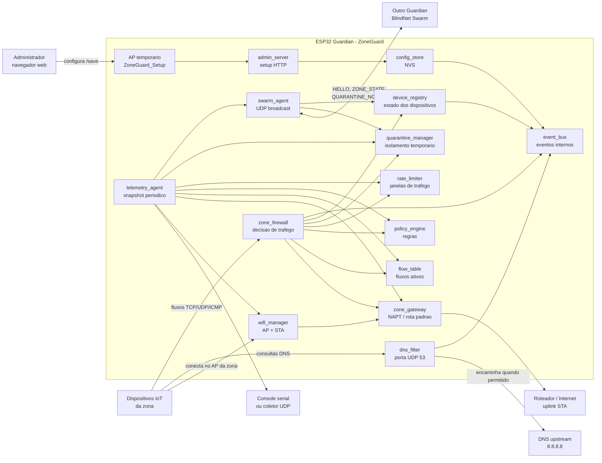
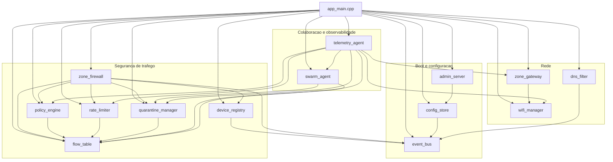
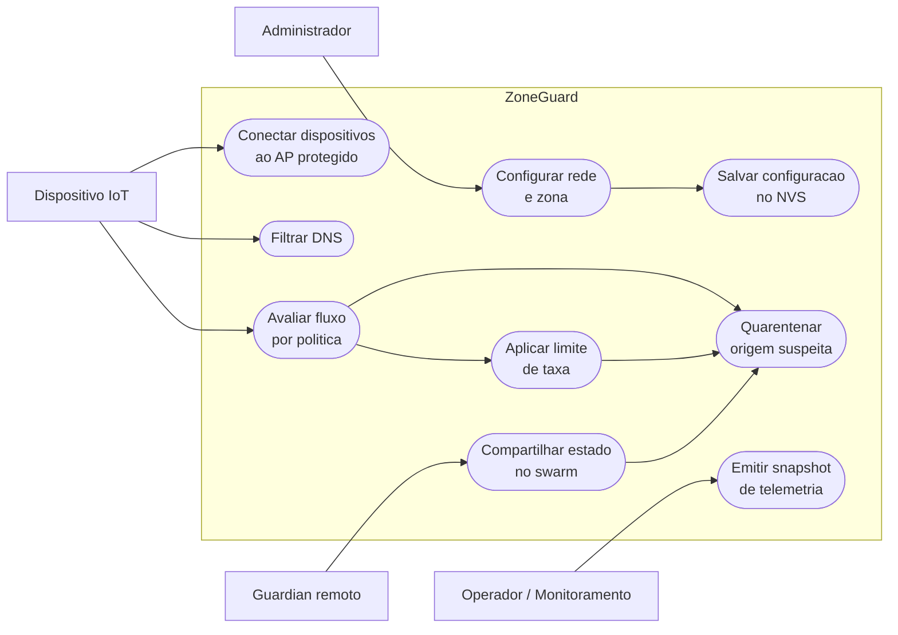
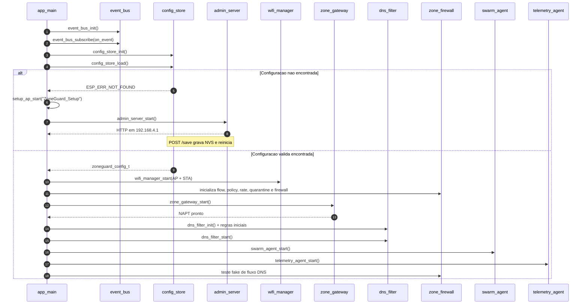
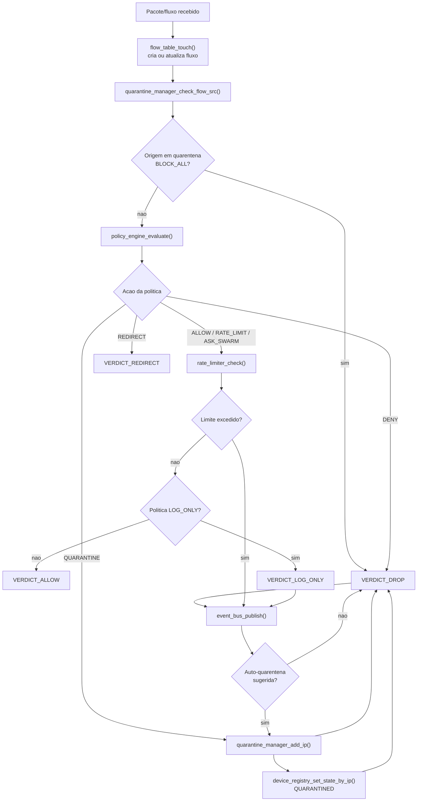
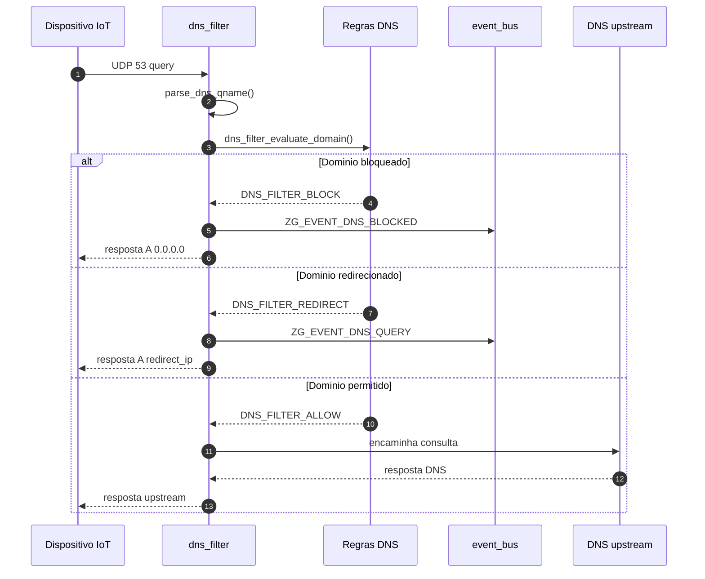
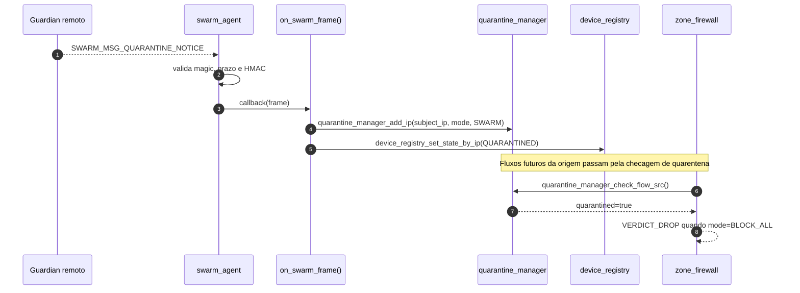
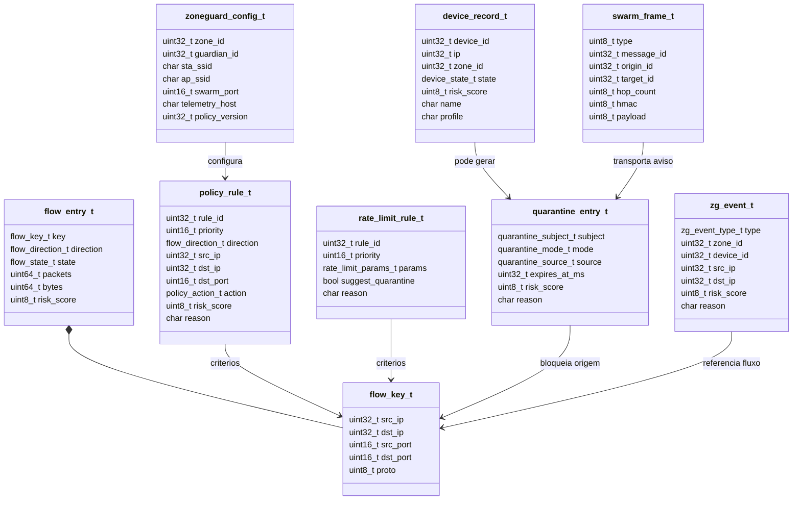
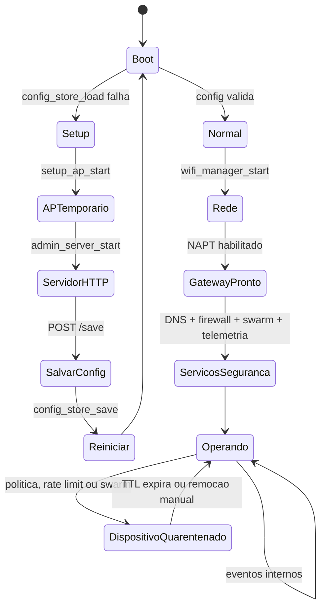
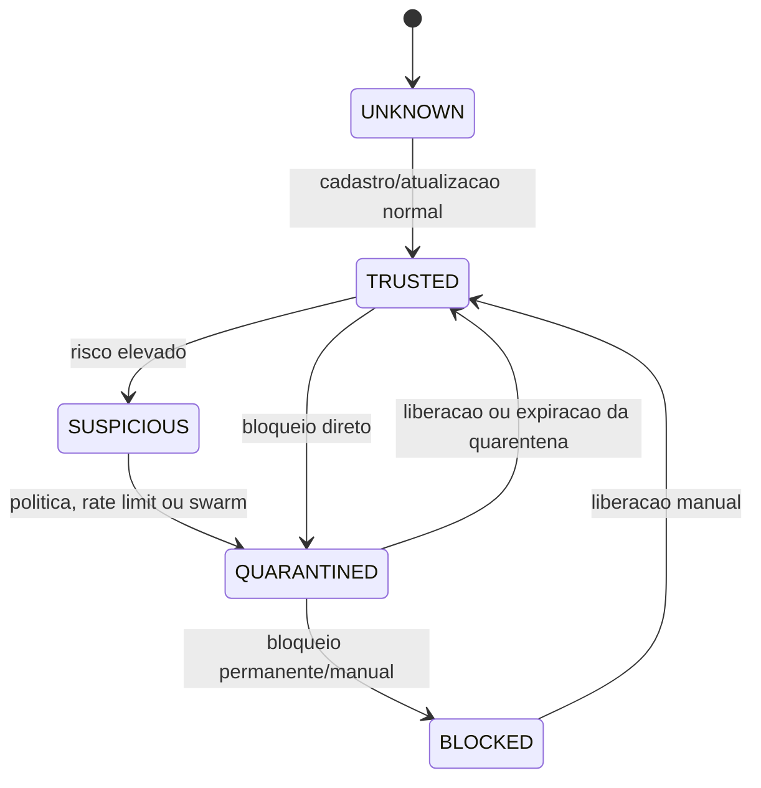

# Diagramas principais - BlindNet / ZoneGuard

Este documento consolida os diagramas principais do firmware ZoneGuard, com base nos componentes em `firmware/main/app_main.cpp` e `firmware/components/`.

## 1. Arquitetura geral

## 2. Componentes internos e dependencias

## 3. Casos de uso principais

## 4. Boot e selecao de modo

## 5. Fluxo de decisao do firewall

## 6. Fluxo de DNS filtrado

## 7. Swarm e quarentena compartilhada

## 8. Modelo de dados principal

## 9. Estados principais

## 10. Estados do dispositivo

## Fontes do codigo

- `firmware/main/app_main.cpp`
- `firmware/components/zone_firewall/zone_firewall.c`
- `firmware/components/dns_filter/dns_filter.c`
- `firmware/components/swarm_agent/swarm_agent.hpp`
- `firmware/components/telemetry_agent/telemetry_agent.cpp`
- `firmware/components/config_store/config_store.c`
- `firmware/components/admin_server/admin_server.c`
